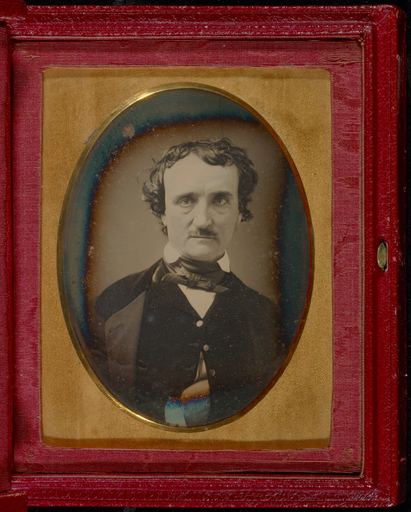

# The Haunted Palace
## by Edward Allen Poe

_In the greenest of our valleys
By good angels tenanted,
Once a fair and stately palace 
Radiant palace reared its head.
In the monarch Thought's dominion 
It stood there!
Never seraph spread a pinion
Over fabric half so fair!_

_Banners yellow, glorious, golden,
On its roof did float and flow,
(This all this was in the olden
Time long ago),
And every gentle air that dallied,
In that sweet day,
Along the ramparts plumed and pallid,
A winged odor went away._

_Wanderers in that happy valley,
Through two luminous windows, saw
Spirits moving musically,
To a lute's well-tun&egrave;d law,
Bound about a throne where, sitting
(Porphyrogene!)
In state his glory well befitting,
The ruler of the realm was seen._

_And all with pearl and ruby glowing
Was the fair palace door,
Through which came flowing, flowing, flowing,
And sparkling evermore,
A troop of Echoes, whose sweet duty
Was but to sing,
In voices of surpassing beauty,
The wit and wisdom of their king._

_But evil things, in robes of sorrow,
Assailed the monarch's high estate.
(Ah, let us mourn! for never morrow
Shall dawn upon him desolate !)
And round about his home the glory
That blushed and bloomed,
Is but a dim-remembered story
Of the old time entombed._

_And travellers, now, within that valley,
Through the red-litten windows see
Vast forms, that move fantastically
To a discordant melody,
While, like a ghastly rapid river,
Through the pale door
A hideous throng rush out forever
And laugh but smile no more._

__Sources__

* __[public-domain-poetry.com](https://www.public-domain-poetry.com/edgar-allan-poe/haunted-palace-1738)__

* __[getty.edu](http://www.getty.edu/art/collection/objects/33002/unknown-maker-american-portrait-of-edgar-allan-poe-american-late-may-early-june-1849/)__
