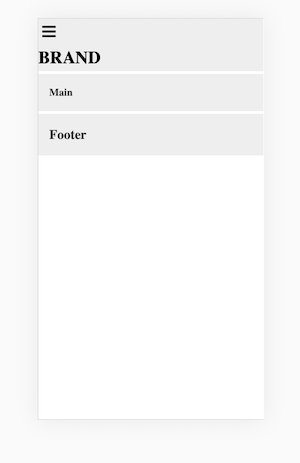

# Pure CSS Hamburger Navigation Using Target Pseudo Selector

CSS3 has given us the ability to add user interaction to web pages without using JavaScript.  In this assignment we'll use the `:target` pseudo selector to make a hamburger link clickable so that we can show vertically aligned navigation on a small screen.  We'll use an internal link to make the close button for the vertical menu interactive and it will just return to rendered state.  We'll use media queries to activate the target on small sized screens and then show a horizontal layout at large screens.

In the past developers have had to use JavaScript to create a the responsive hamburger nav.  This technique uses some advanced styling with `transition` and `transform`.  Don't worry if this doesn't make sense right away, but just know that these properties allow us to move content in an out of view in an animated way, so that the user follows what's happening.

Read more about the CSS used in this technique in docs referenced in the Resources section.

## UTF Symbols and HTML Entities
You'll notice that the hamburger is coded as `&#9776;`.  Values, whether text or numeric, placed with in `&` and `;` are HTML special entities.  They are treated and styled as characters.  If you can use an HTML entity instead of an icon or images, it carries a lot less "baggage" - that is you don't have to download any files to support it.  You can find a list of UTF Symbols such as the hamburger here: https://www.w3schools.com/charsets/ref_utf_symbols.asp.  You can find a list of html entities here: https://dev.w3.org/html5/html-author/charref. There is the possiblity of needing the display a greater than symbol on an HTML page and you can't use `>` because the browser will try to interpret it as part of a tag, so you'd need to use the html entity `&gt;`.

## Assignment
You'll find a style sheet attached to the index.html.  It provides some basic styling to the nav bar, but if you view the page, you'll see a **hamburger** and an **X** that don't make sense.  Also the nav will be vertically aligned for all screen sizes.  

1. Start with a media query for a large screen in which we want to hide the hamburger and display a horizontal nav bar. Add the following media query to the style sheet.  Notice that we use `inline-block` to make a horizontal nav bar.  We also hide the hamburger using `display:none`.

```
 @media only screen and (min-width: 600px) {

      /* nav styles */
      nav ul li {
        display: inline-block;
        padding: 0 20px 0 0;
        width: 100px;
      }

      /* hide toggle */
      .toggle {
        display: none;
      }

      .header {
        padding: 0 20px;
        width: 100%;
        height: auto;
      }

    }

```
2. Next we'll add a media query for the small screen.  We're cutting it off at 600px which is smaller than an ipad (728px). Add the following to the style sheet.  The `:target` is attached to the nav using the id `#nav`. The hamburger is part of an anchor that links to `#nav` so the target styles are applied to the `#nav` when the toggle link is clicked.  Because we're in a smaller screen, we get the default vertical navigation.  The `#nav` transforms to fit into the smaller screen and a transition is applied to help the user see what's happening.  
```
/* media query for small screen */
    /* hide the nav bar */
    @media only screen and (max-width: 600px) {

      /* #nav is activated by clicking on hamburger whose href is nav*/
      #nav {
        transition: transform .3s ease-in-out;
        top: 0;
        bottom: 0;
        position: fixed;
        width: 300px;
        right: -340px;
      }

      /* the href="nav" on the toggle causes the nav:target selectors to activate */
      #nav:target {
        transform: translateX(-340px);
      }

      /* show the close X on the right */
      .close {
        text-align: right;
        display: block;
        text-decoration: none;
        font-size: 3em;
        position: relative;
        top: -30px;
      }

      /*show the hamburger toggle on the left */
      .open {
        text-align: left;
        color: black;
        font-size: 2em;
        padding-left: 5px;
      }

    }

```

## Resources
Read about the `:target` pseudo selector here: [Mozilla Developer Network](https://developer.mozilla.org/en-US/docs/Web/CSS/:target)

Read about `transition` here: [Mozilla Developer Network](https://developer.mozilla.org/en-US/docs/Web/CSS/transition)

Read about `transform` here: [Mozilla Developer Network](https://developer.mozilla.org/en-US/docs/Web/CSS/transform)

## Solution Views

###  Large Screen


### Small screen menu closed


### Small screen menu opened
